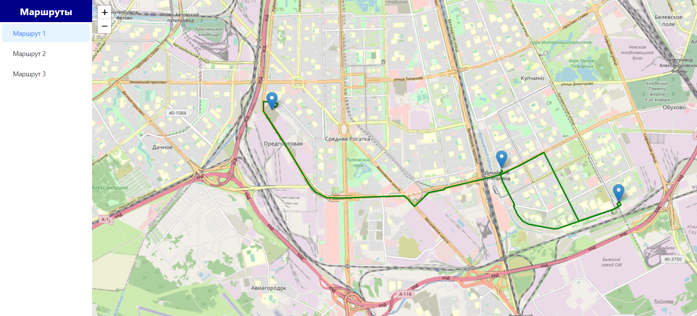
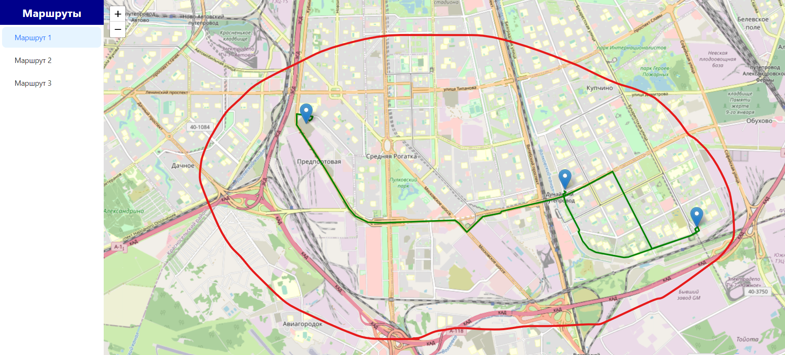

# Приложение "Map"

Это приложение карты, разработанное с использованием React, Redux-Toolkit/Saga, OSRM API, React-Leaflet и Ant Design. Оно позволяет пользователям просматривать различные маршруты на карте, выбирать маршруты из списка и видеть соответствующие маркеры на карте.

## Особенности

- Отображение маршрутов на карте
- Список маршрутов с опцией выбора
- Отображение маркеров для начальной, промежуточной и конечной точек выбранного маршрута
- Интеграция с OpenStreetMap и API OSRM для получения данных о маршрутах

## Используемые технологии

- React
- Redux (Redux Toolkit)
- Ant Design (фреймворк для пользовательского интерфейса)
- Leaflet, React-Leaflet (для интерактивных карт)
- Axios (для HTTP-запросов)
- OSRM API (для получения данных о маршрутах, polylines)
## Структура проекта

Проект имеет следующую структуру:

- `src/components/MapComponent.jsx`: Основной компонент карты с маршрутами и маркерами.
- `src/components/RouteList.jsx`: Компонент для отображения списка маршрутов.
- `src/constants/coords.js`: Массив с координатами маршрутов.
- `src/services/httpService.js`: Сервис для отправки HTTP-запросов к API OSRM.
- Файлы Redux Slice и Saga: Отвечают за управление состоянием и получение данных о маршрутах.

## Установка

1. Клонируйте репозиторий с помощью `git clone <repository-url>`.
2. Установите зависимости с помощью `npm install`.
3. Запустите сервер разработки с помощью `npm start`.

## Использование

1. После открытия приложения список маршрутов будет отображаться слева.

2. Щелкните по маршруту в списке, чтобы увидеть его на карте и маркеры.

3. Карта автоматически подстроится под границы выбранного маршрута.

## Вклад

Ваши вклады приветствуются! Если вы обнаружили какие-либо проблемы или у вас есть предложения по улучшению, не стесняйтесь создать pull request или открыть issue.

## Лицензия

Этот проект лицензирован в соответствии с лицензией MIT. См. файл [LICENSE](LICENSE) для получения дополнительной информации.
